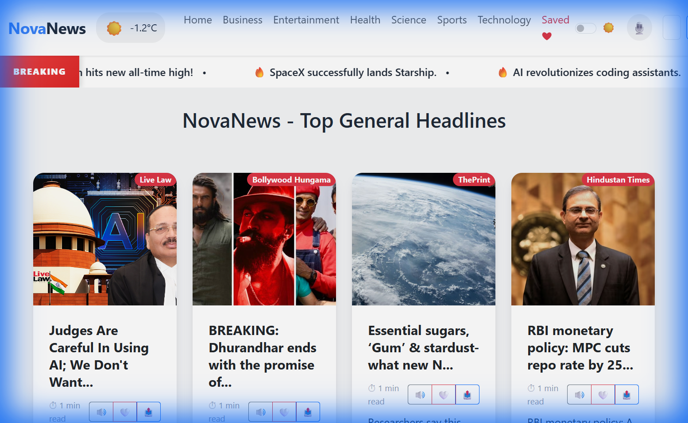
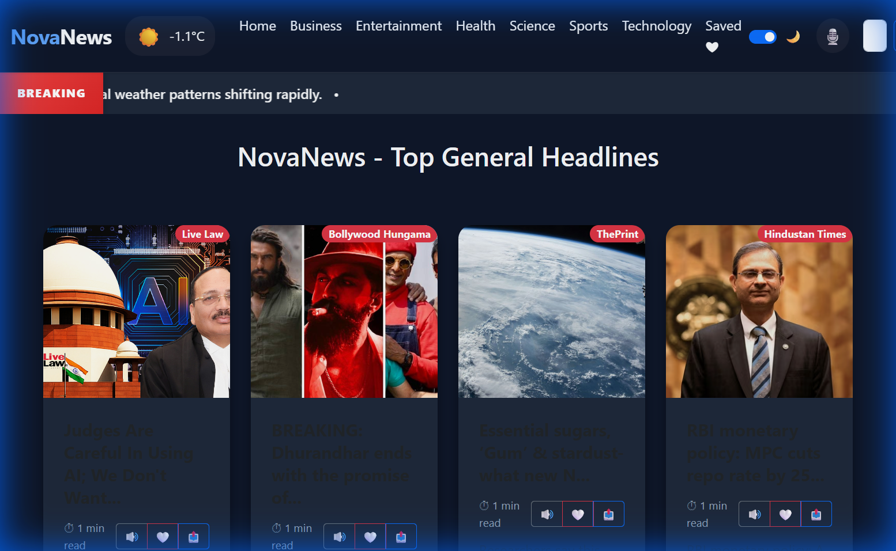

<div align="center">
  

  # NovaNews
  
  **Your daily dose of news for free!**

  <p>
    <a href="https://reactjs.org/">
      
    </a>
    <a href="https://getbootstrap.com/">
      
    </a>
    <a href="https://gnews.io/">
      
    </a>
     <a href="LICENSE">
      
    </a>
  </p>
</div>

---

## 📖 About
**NovaNews** is a modern, React-based news aggregation application that delivers top headlines from around the world. Designed with a clean, responsive UI using Bootstrap 5, it offers a seamless reading experience across devices. Whether you're tracking business trends, catching up on sports, or looking for the latest tech updates, NovaNews has you covered.

## ✨ Key Features

-   **📰 Top Headlines**: Real-time news updates across 7 major categories: Business, Entertainment, Health, Science, Sports, Technology, and General.
-   **🎨 Dark/Light Mode**: Toggle between a sleek dark theme and a crisp light theme for comfortable reading in any lighting.
-   **🎙️ Voice Commands & Text-to-Speech**: Navigate the app using voice commands (e.g., "Open Sports") and listen to articles with one-click text-to-speech.
-   **⛅ Weather Widget**: Integrated real-time weather updates right in the navbar.
-   **💾 Read Later**: Save articles to your personal "Saved" list to read them anytime, even offline.
-   **🔍 Infinite Scroll**: Seamlessly load more news as you scroll (or use traditional pagination).
-   **📱 Fully Responsive**: Optimized for mobile, tablet, and desktop views.

## 📸 Screenshots

<div align="center">
  <table>
    <tr>
      <td align="center">
        <b>Light Mode</b><br>
        
      </td>
      <td align="center">
        <b>Dark Mode</b><br>
        
      </td>
    </tr>
  </table>
</div>

## 🛠️ Tech Stack

-   **Frontend**: React (Hooks, Functional Components, Context API), React Router v6.
-   **Styling**: Bootstrap 5, CSS3, Glassmorphism effects.
-   **API Integration**: [GNews API](https://gnews.io/) (News data), [Open-Meteo](https://open-meteo.com/) (Weather data).
-   **Utilities**: `react-top-loading-bar` (Loading indicators), standard Web Speech API (Voice features).

## 🚀 Getting Started

Follow these instructions to get a copy of the project up and running on your local machine.

### Prerequisites

-   Node.js (v14 or higher)
-   npm (v6 or higher)

### Installation

1.  **Clone the repository**
    ```bash
    git clone https://github.com/your-username/newsapp.git
    cd newsapp
    ```

2.  **Install dependencies**
    ```bash
    npm install
    ```

3.  **Configure Environment Variables**
    Create a `.env` file in the root directory and add your GNews API key:
    ```env
    REACT_APP_NEWS_API_KEY=your_api_key_here
    ```
    > **Note**: You can get a free API key from [GNews.io](https://gnews.io/).

4.  **Run the application**
    ```bash
    npm start
    ```
    The app will launch in your browser at `http://localhost:3000`.

## 📂 Project Structure

```bash
newsapp/
├── public/             # Static assets (ico, manifest, etc.)
├── src/
│   ├── components/     # Reusable React components
│   │   ├── NavBar.js   # Navigation, Search, Voice, Dark Mode
│   │   ├── News.js     # Main news feed logic
│   │   ├── NewsItem.js # Individual news card
│   │   ├── Spinner.js  # Loading spinner
│   │   └── Ticker.js   # Breaking news ticker
│   ├── App.js          # Root component & Routing
│   ├── App.css         # Global styles & Variables
│   └── index.js        # Entry point
├── assets/             # Screenshots & Banner for README
├── .env                # API Keys (gitignored)
└── package.json        # Dependencies & Scripts
```

## 📄 License
This project is licensed under the MIT License - see the [LICENSE](LICENSE) file for details.

---
<div align="center">
  Made with ❤️ by bbrak
</div>
